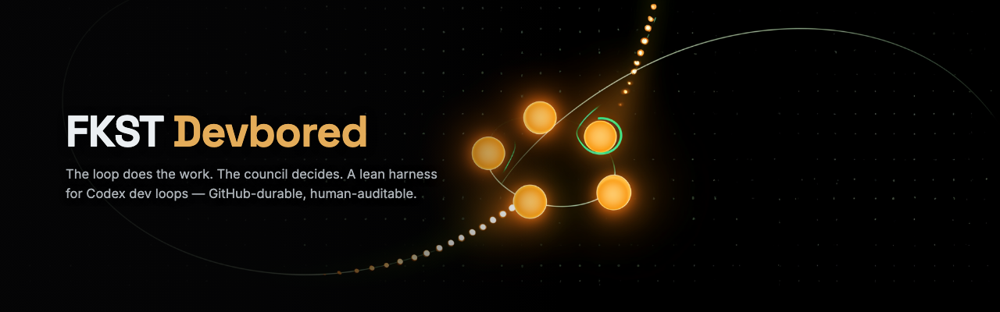
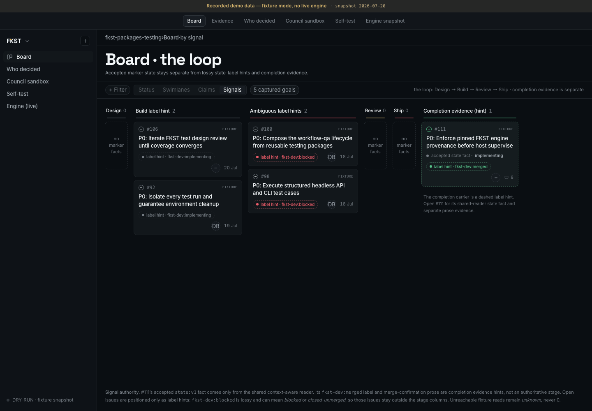
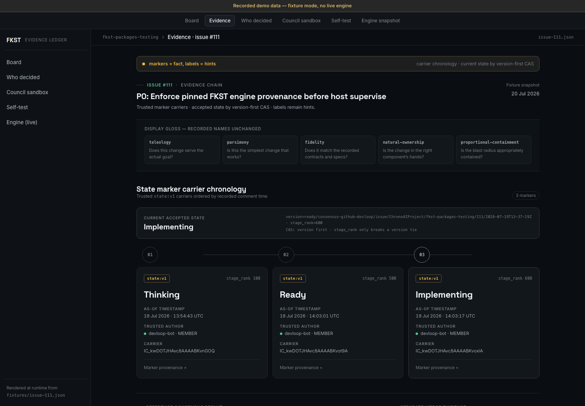
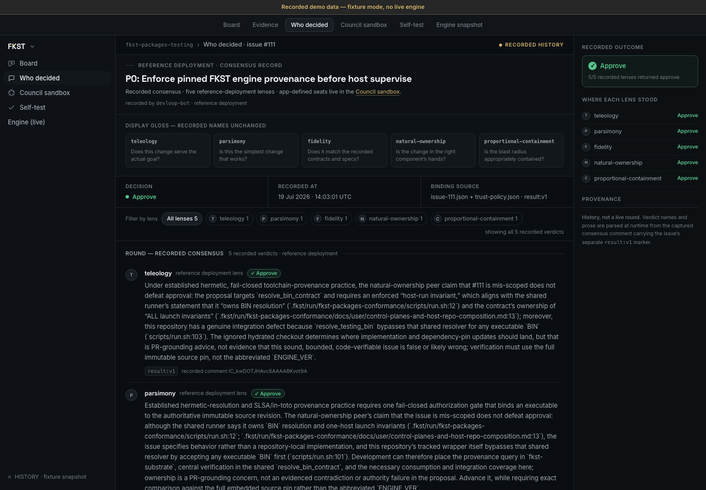
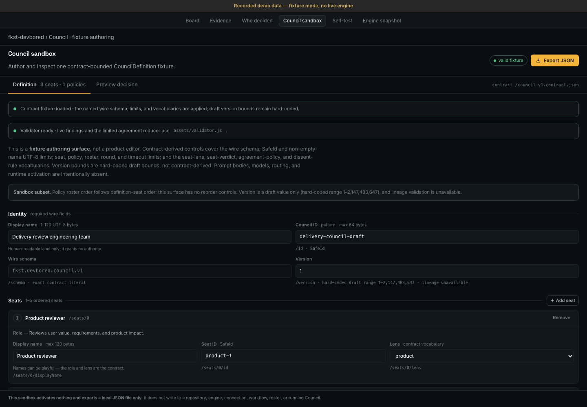
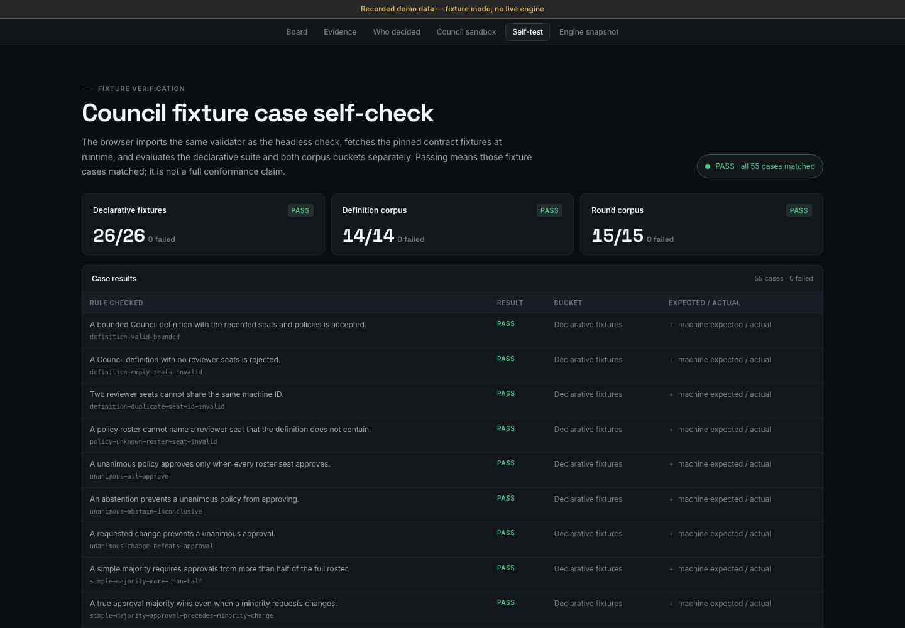
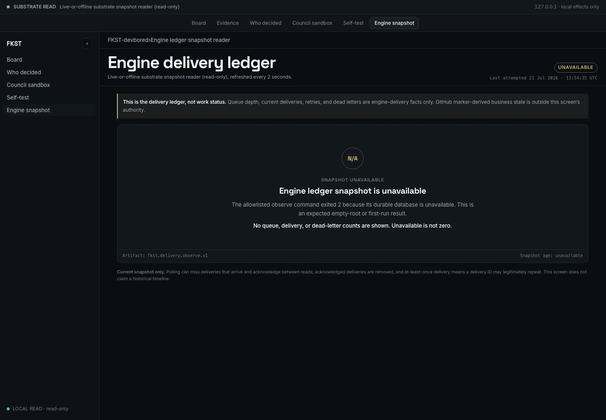

# FKST Devbored



**The loop is all the rage.** Engineers at Anthropic and OpenAI now describe
their day job as building the loop that builds the code. But most loop
architectures are still too basic for complex development work — the
interesting problems live in the *harness* around the loop, not the model
inside it. Inspired by OpenAI's
[Symphony](https://openai.com/index/open-source-codex-orchestration-symphony/)
and the broader
[harness-engineering](https://openai.com/index/harness-engineering/)
conversation, we built this: **an easy way for developers to use Codex to
experiment with their own dev workflows, in a loop.**

Three design choices keep it approachable:

- **Lean, editable architecture.** Small pieces you can actually read and
  reshape — not a framework you configure from the outside.
- **GitHub is the durable layer.** Issues, comments, and labels hold the
  loop's business state — trivially readable and auditable by humans, hosted
  where your code already lives.
- **The front end is a light HTML web layer.** Static pages and vanilla JS
  that most developers can understand and edit to fit their own use case.
  No build step.

## Why a harness at all

Harness engineering is about making the loop work **the way you want**.
Something that runs 24/7 without staying aligned to your own judgment isn't
autonomy — it's loop vibing.

This architecture goes after three concrete problems in agentic coding:

1. **Context management.** Split work into smaller issues and keep process
   state in the durable layer (GitHub issues + trusted marker comments). No
   single context window has to carry the whole project.
2. **Verifiable judgment.** Every decision leaves durable evidence, so you
   can check the agent's reasoning against your own — and reformulate your
   loops and flows when you disagree. The console's rule set is exactly this:
   *markers are facts, labels are hints, unknown is never zero.*
3. **Provider independence.** [`fkst-substrate`](https://github.com/ChronoAIProject/fkst-substrate)
   is a durable loop engine that operates independently of any model
   provider. The source is public on GitHub and can be forked and
   customized.
   <!-- TODO(owner): add a LICENSE to fkst-substrate before calling it
   "open source" — public visibility alone doesn't grant fork/reuse rights. -->

## The console (recorded demo)

A local, static demonstration rendering **real captured loop evidence** from
the public sandbox repo
[`ChronoAIProject/fkst-packages-testing`](https://github.com/ChronoAIProject/fkst-packages-testing).
See [`demo/README.md`](demo/README.md) for the honest-claims list and the
5-beat walkthrough.

```bash
python3 -m http.server 8471 -d demo --bind 127.0.0.1   # static demo
node local-bff/server.mjs                               # optional: engine snapshot (:8472)
# open http://127.0.0.1:8471/
```

| Screen | |
|---|---|
| **Board — the loop** |  |
| **Evidence chain — markers are facts** |  |
| **Who decided — recorded consensus** |  |
| **Council sandbox — form your review team** |  |
| **Contract self-check — 55 cases, human-readable** |  |
| **Engine snapshot — live-or-offline, honest** |  |

## How Codex built this

This repo is its own proof: the console was built **by the kind of loop it
visualizes**, in one day (2026-07-21), on contract work from the preceding
week.

- **Codex implemented everything.** Every build stream was a Codex CLI
  session (recorded model `gpt-5.6-sol`, cli `0.144.6`) with a written spec,
  exclusive file ownership, and a hard test gate — 52 sessions on
  final-assembly day, 25 of them headless `codex exec` build/review streams.
- **Codex also reviewed the plans adversarially.** Its reconciliation review
  RETURNed the first scope dossier with 8 blocking fixes; its round-close
  review found 5 latent semantic faults (trust gates, CAS ordering,
  availability semantics) — all fixed and re-verified.
- **Decisions ran through the loop too.** A Fable PM wrote specs and
  integrated; independent Opus 4.8 reviews verified actual files with hostile
  probes before anything was accepted; the human owner held the gates. Even
  this repo's **name** came from a recorded 6-seat council deliberation
  reduced with the repo's own validator — FKST-devbored won 5/6 over
  FKST-agora and FKST-kanban, dissent preserved.
- **Deliberately multi-session.** The workflow fans out many Codex sessions
  with frozen interfaces between them — that *is* the harness thesis, in the
  spirit of Symphony. The full session roster, the primary `/feedback`
  session ID, and the complete requirements checklist live in
  [`docs/SUBMISSION.md`](docs/SUBMISSION.md).

## Where this is going

The ship plan of record is the converged `PM-PLAN-V2-REFACTOR` (Codex+Fable,
owner-arbitrated). Its non-negotiables:

1. **FKST substrate runs the product** — all loop execution (departments,
   queues, delivery, retries, liveness) runs on `fkst-substrate`.
2. **GitHub issues are the durable business layer** — work facts and evidence
   live as trusted markers/comments/labels; no local business authority.
3. **Working council loops, debating via GitHub** — a configurable council
   deliberates real work, and the debate itself (ordered per-seat verdicts
   and arguments) is carried durably on GitHub.

Near-term, in order: live read-only GitHub business reads behind the local
BFF (trust-gated, truncation-honest), then launch-snapshot Workflow/Council
configuration — authored in the console's sandbox, applied only at loop
launch with explicit acceptance receipts. Remote writes stay behind explicit
human authorization at every step. An earlier Flutter desktop plan is
scrapped; `docs/spec/` remains authoritative for the Workflow/Council
contracts and is otherwise retained as engineering history.

### Invariants (these survive every refactor)

> GitHub/git own business state. `fkst-substrate` owns its delivery ledger.
> The console holds no authority — everything it stores is a disposable
> projection.

### Repository layout

```text
demo/            the console (static HTML) + fixtures + contract self-check
local-bff/       loopback read-only substrate snapshot reader (runtime.html)
contracts/       Workflow/Council contract kernel (Dart/Lua/JSON + parity tests)
docs/spec/       contract definitions (authoritative) + engineering history
docs/assets/     README banner + screenshots
plans/           retained planning registries (historical)
mock-artifacts/  approved design mocks the console is aligned to
```

## Credits

[Symphony](https://openai.com/index/open-source-codex-orchestration-symphony/) ·
[harness engineering](https://openai.com/index/harness-engineering/) ·
[openai/symphony](https://github.com/openai/symphony) ·
[the harness-eng talk](https://www.latent.space/p/harness-eng)

## License

[Apache-2.0](LICENSE) © 2026 ChronoAI Project

AI:FKST
